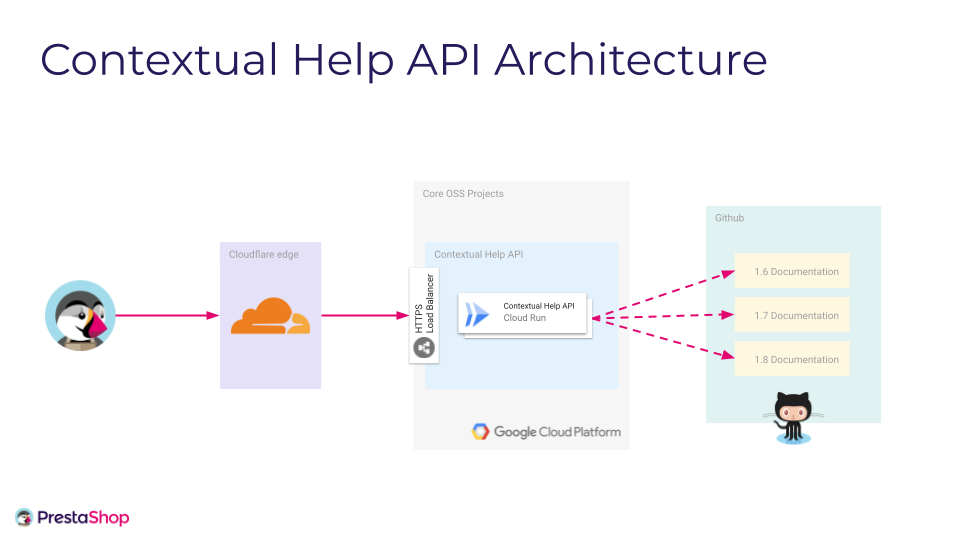
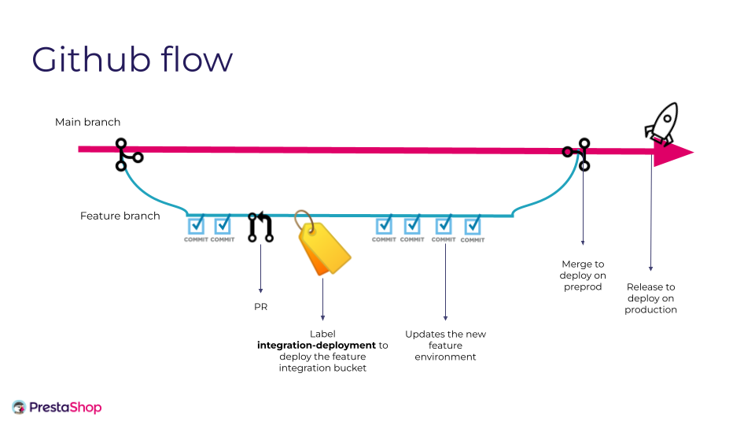

# Contextsual Help API

## Architecture

## Workflow

## Inputs variables

You can modify inputs variable here [here](variables.tf)
* stage used to determine application stage target (alpha/stable)
* app_version is used to pull correct docker image
* hash_id is used to force reapply deployment that has already been deployed

### Environment variables

We currently use 2 ressources for environment variables.
All those are direclty injected to the Cloud Run runtime through GCP Secrets.

* [integration app key variable](https://console.cloud.google.com/security/secret-manager/secret/contextual-help-api-key/versions?cloudshell=false&project=core-oss-integration)
* [integration google analytics key variable](https://console.cloud.google.com/security/secret-manager/secret/contextual-help-api-google-analytics/versions?cloudshell=false&project=core-oss-integration)
* [preprod app key variable SOON]()
* [preprod google analytics key variable SOON]()
* [production app key variable SOON]()
* [production google analytics key variable SOON]()

## CI/CD

Github action automatically deploy this configuration.
* [Integration](../.github/workflows/contextual-help-api-cd-integration.yml )
> Through this configuration, we are providing 9 prestabulles environment, that allow to deploy, through a label set, the current PR code to the environment.
> A given PR can only be triggered to 1 and only one given prestabulle at a given time
> Once the PR is merged, the prestabulle environnement will be destroyed

* [Preprod SOON](../.github/workflows/contextual-help-api-cd-preprod.yml )
> Push on the master branch will trigger a build and a deployment on the preprod environment

* [Production SOON](../.github/workflows/contextual-help-api-cd-production.yml)
> A release will automatically trigger the current tag to be deployed on the production environment.

## Application urls

* [Contextual Help API Integration](https://integration-help.prestashop-project.org/en/doc/AdminDashboard?version=1.7.8.0)
* [Contextual Help API Preprod](https://preprod-help.prestashop-project.org/en/doc/AdminDashboard?version=1.7.8.0)
* [Contextual Help API Production](https://help.prestashop-project.org/en/doc/AdminDashboard?version=1.7.8.0)
